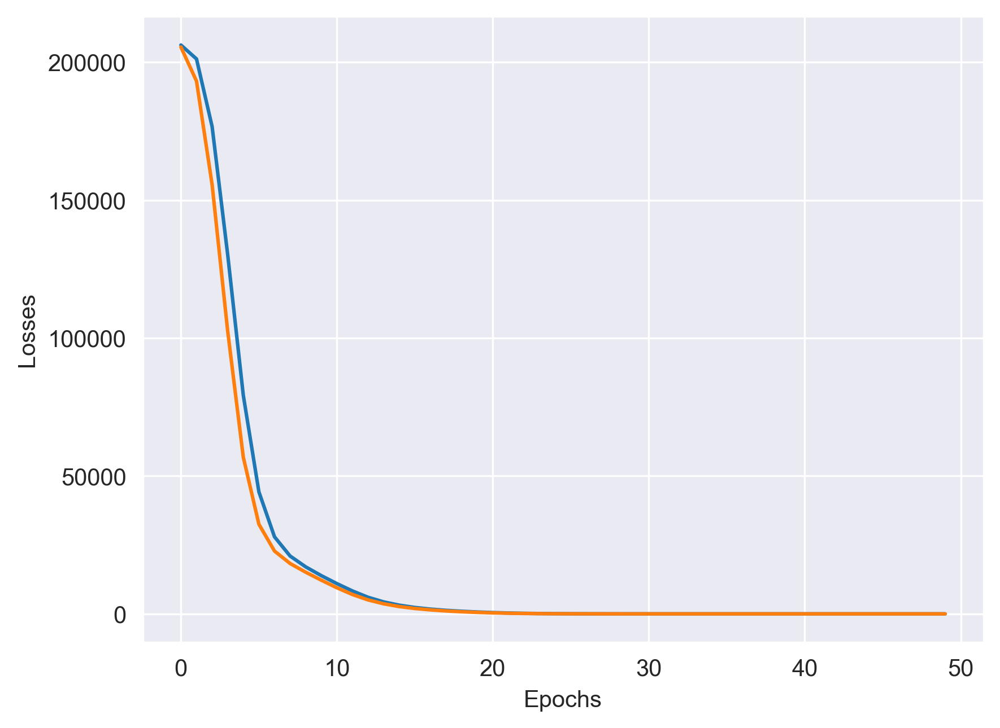

# Power Plant Energy Prediction using ANN

In this project, I implemented concepts of Artificial Neural Networks (ANN) by performing regression on the Power Plant Energy Prediction dataset.
The objective of the project was to predict electrical energy output (PE) using environmental parameters such as Ambient Temperature (AT), Exhaust Vacuum (V), Ambient Pressure (AP), and Relative Humidity (RH).

The workflow included Exploratory Data Analysis (EDA), data preprocessing, feature scaling, ANN model building using PyTorch, training and validation, and finally evaluating the regression performance of the network.

# Learnings
- Learnt ANN architecture and regression concepts
- Explored feature relationships using EDA techniques
- Understood feature scaling and preprocessing methods
- Training and validation loss analysis
- Regression evaluation metrics such as MSE and R² Score
- Tensor conversion and model optimization using PyTorch

# Exploratory Data Analysis (EDA)
- Most features were approximately normally distributed with no major skewness
- Temperature (AT) and Vacuum (V) showed strong negative correlation with Power Output (PE)
- Pressure (AP) and Humidity (RH) showed moderate positive correlation with PE
- Minor outliers were observed but were not significant enough to affect model performance
- Dataset was clean with no missing values and duplicates were handled properly

# Debugging
- Fixed logical and implementation mistakes during model training
- Verified preprocessing and tensor conversion pipeline
- Optimized training flow for stable convergence
- Monitored training and validation losses to avoid overfitting
- Tuned model parameters for improved regression performance

These improvements helped the ANN model learn dataset patterns effectively and achieve stable prediction performance.

# Results

The ANN regression model achieved stable convergence, with both training and validation loss decreasing smoothly across epochs.

**The model achieved:**

- Training MSE: **~20.58**
- Testing MSE: **~20.44**
- R² Score: **0.93**

The minimal gap between training and validation loss indicates good *generalization capability* and *no major overfitting*. Overall, the model captured the relationship between environmental features and electrical power output effectively.

# Training and Validation Loss Graph

  

  <em>Training vs Validation Loss across epochs for the ANN regression model.</em>

# Model Performance Conclusion
- Low MSE indicates accurate prediction performance
- High R² score **(0.93)** shows strong predictive capability
- Stable loss convergence confirms effective learning behavior
- Model generalized well on unseen testing data without significant overfitting

# Tech Stack
- Python
- PyTorch
- Python Libraries- Pandas, Matplotlib, Seaborn
- Scikit-learn
- Jupyter Notebook
